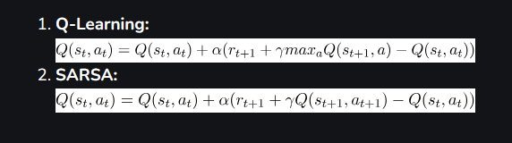

Hoàn thành việc chỉnh sửa không gian mạng Conv1D:

- Sửa lỗi không thể chạy được mô hình Conv1D với dữ liệu đầu vào có kích thước khác nhau.
- Tìm ra được nguyên nhân cho data cardinality do input của state nhận đủ mảng 1 chiều nhưng hai input ma trận lại bị lỗi.
- Để chỉnh sử vấn đề này, ta thực hiện reshape lại hai matrix kia thành matrix với size (K * K), gộp hết các biến phân tán lẻ lại thành từng khối

Chi tiết giải thích trong file: demoerror01.drawio

Hoàn thành hàm tính toán fnr/fpr

- Ý tưởng thiết kế chính của hàm fnr/fpr trong file fnr_fpr_final_idea.png
- Các bước thực hiện:
    Với mỗi node trong mạng:
    - Tính toán các giá trị TP, TN, FP, FN dựa trên FNR/FPR và điểm số EPSS (để suy ra attack rate) tại mỗi node
    - Hai trường hợp đối nghịch sẽ được chọn ra và chia tỉ lệ sao cho đủ 100% 
    - Nếu giá trị thực tại node là 0, có hai trường hợp đối nghịch diễn ra:
        - True negative (thực tế đúng là ko có attack) - với tỉ lệ chọn là tn_prob, giữ nguyên 0
        - False positive (thực tế không có attack nhưng dự đoán có) - với tỉ lệ chọn là fp_prob, lật 0 thành 1
    - Nếu giá trị thực tại node là 1, có hai trường hợp đối nghịch diễn ra:
        - True positive (thực tế đúng là có attack) - với tỉ lệ chọn là tp_prob, giữ nguyên 1
        - False negative (thực tế có attack nhưng dự đoán không có) - với tỉ lệ chọn là fn_prob, lật 1 thành 0

- Thuật toán trả về mảng nparray thể hiện state mà defender nhận được sau khi có FNR/FPR can thiệp

Hoàn thành mô hình SARSA cơ bản

SARSA sử dụng DQN để thao tác với không gian action/state lớn

Điểm khác biệt giữa SARSA và DDQN:

SARSA (State-Action-Reward-State-Action): hành động tiếp theo (a') được chọn bằng chính policy đang được đánh giá và cải thiện (thường là ε-greedy). 
Do đó, thuật toán này là thuật toán phụ thuộc policy (on-policy).

DQN thuần (mà DDQN sử dụng): hành động tiếp theo được chọn dựa trên greedy policy dựa vào Q-network. 
Tuy nhiên, Q-network này được cập nhật dựa trên giá trị Q tối đa của hành động kế tiếp (max(a') Q(s',a')) bất kể policy nào đang được sử dụng. 
Vậy đây là phương pháp không phụ thuộc policy (off-policy) vì chiến thuật greedy policy 
dùng để update Q-values có thể khác với chiến thuật mà agent đang theo đuổi.

Kết luận:
SARSA dựa trên DQN sẽ thực hiện chọn cả hai hành động (a) và (a') dựa trên cùng 1 policy 
(ở đây chọn ε-greedy) và cập nhật mạng neural dựa trên trạng thái thay đổi quan sát được (s, a, r, s', a').

Code minh họa

Kết quả chạy

Total evaluation rewards:  [1.0, 1.0, 1.0, 1.0, 1.0, 1.0, 1.0, -1.0, 1.0, 1.0, 1.0, 1.0, 1.0, -1.0, 1.0, 1.0, 1.0, 1.0, 1.0, 1.0, 1.0, 1.0, 1.0, 1.0, 1.0, -1.0, 1.0, -1.0, 1.0, 1.0, 1.0, 1.0, 1.0, 1.0, 1.0, 1.0, -1.0, 1.0, 1.0, 1.0, 1.0, 1.0, 1.0, 1.0, 1.0, 1.0, 1.0, 1.0, 1.0, 1.0, 1.0, 1.0, 1.0, 1.0, 1.0, 1.0, 1.0, 1.0, 1.0, 1.0, 1.0, 1.0, 1.0, 1.0, 1.0, 1.0, 1.0, 1.0, 1.0, 1.0, 1.0, 1.0, 1.0, 1.0, 1.0, 1.0, 1.0, 1.0, 1.0, 1.0, 1.0, 1.0, 1.0, 1.0, -1.0, 1.0, 1.0, 1.0, 1.0, 1.0, 1.0, 1.0, -1.0, 1.0, 1.0, 1.0, 1.0, 1.0, 1.0, 1.0]