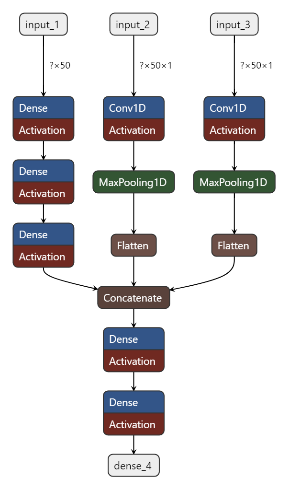
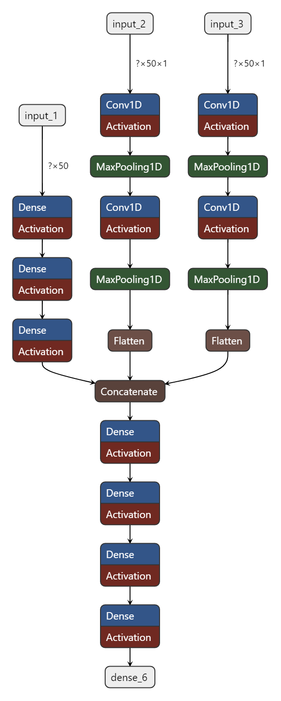
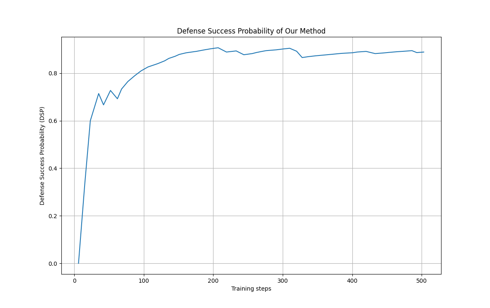
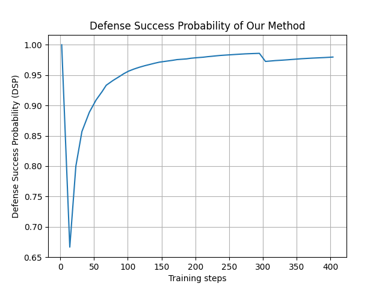
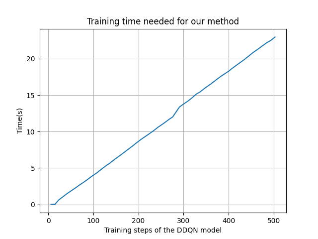
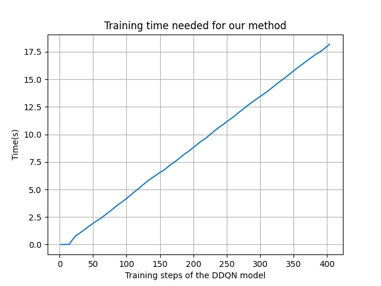

Đã hoàn thành thiết kế và thử nghiệm mạng Conv1D cho 2 ma trận 2 chiều ntpg và epss

Cau truc cua mang neuron Conv1D so khai:

Cau truc cua mang neuron duoConv1D: 

Ket qua DSP thu duoc cua mang conv1D so khai:

Ket qua DSP thu duoc cua mang duoConv1D:

=> Ket qua DSP cho thay mang Conv1D so khai dat duoc do chinh xac trong vong it step hon so voi mang dense truyen thong

=> Ngoai ra, duoConv1D cho ket qua DSP giao dong cao hon so voi Conv1D so khai, tuy nhien co kha nang dat den 0.9 trong so timestep thap hon so voi Conv1D so khai

=> Toc do hoi tu cua duoConv1D nhanh hon so voi Conv1D so khai

Ket qua training time thu duoc cua mang conv1D so khai:

Ket qua training time thu duoc cua mang duoConv1D:

=> So voi mang dense truyen thong, mang Conv1D so khai co toc do training nhanh hon khoang 1/3 

=> Ngoai ra, mang duoConv1D co toc do training nhanh hon so voi mang Conv1D so khai (~17.6 so voi ~22) 

=> Ket qua training time cho thay mang duoConv1D cho toc do huan luyen cao hon so voi mang Conv1D so khai

Thực hiện thí nghiệm fnr fpr bằng cách gọi hàm simulate_attacks_and_alerts từ .\Development\TrainingCode\fnr_fpr_test\fnrfpr_v2.py trong file env

thực hiện thay đổi state ngay khi attacker di chuyển (attacker duoc xem nhu 1 bien so moi truong, cu moi lan attacker di chuyen state se thay doi)

=> state duoc khoi tao - attacker thuc hien tan cong - state thay doi - goi simulate_attacks_and_alerts - aftermath state + fnr/fpr

=> sai y tuong -> thay doi state phai duoc thuc hien ngay truoc khi agent du doan

=> da tao moi hai file ENV va AGENT danh rieng cho fnr/fpr (Development\TrainingCode\NetworkHoneypotEnv_fnrfpr.py va Development\TrainingCode\ddqn_agent_headless_fnrfpr.py)

=> tao moi DRIVER rieng cho fnr/fpr (Development\TrainingCode\driver_fnrfpr.py)

Thay doi co ban cua cac file:

- DRIVER: Khai bao them cac tham so cho fnr/fpr, su dung AGENT + ENV rieng cho fnr/fpr va thay doi cach dat ten cac mo hinh duoc huan luyen theo fnr/fpr

- ENV: ban dau co thay doi nhung bi sai logic nen da khoi phuc lai tuong tu nhu ENV goc

- AGENT: thuc hien import function dong 51,52 + dong 315-331 truc tiep chinh sua currentstate.observation va thay the bang alerted_observation, sau do bien doi alerted_observation thanh dang numpy.ndarray de co the dua vao mainNetwork va predict