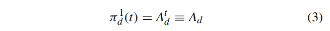

# Structure
Bài viết được chia thành sáu phần. 

Phần đầu tiên là phần giới thiệu, trong đó đưa ra nền tảng, động lực và ý tưởng chính của bài báo. 

Phần thứ hai là phần đặt vấn đề, trong đó các định nghĩa, giả định và mục tiêu của vấn đề triển khai tài nguyên đánh lừa được giải thích. 

Phần thứ ba là sàng lọc sơ bộ, trong đó một phương pháp dựa trên TPG được đề xuất để lọc ra các vị trí triển khai tài nguyên lừa đảo không hiệu quả. 

Phần thứ tư là chính sách triển khai thông minh, trong đó một phương pháp dựa trên RL được đề xuất để tự động điều chỉnh vị trí của các tài nguyên đánh lừa theo trạng thái an ninh mạng. 

Phần thứ năm là các thử nghiệm, trong đó hiệu suất và hiệu quả của các phương pháp được đề xuất được đánh giá và so sánh với các phương pháp khác. 

Phần thứ sáu là phần kết luận, trong đó tóm tắt những phát hiện chính, đóng góp và công việc trong tương lai của bài báo.

# Abstract
Đoạn văn nói về một bài báo nghiên cứu đề xuất một chính sách triển khai thông minh cho các tài nguyên đánh lừa trong mạng. 

Tài nguyên lừa đảo là tài sản giả mạo hoặc gây hiểu lầm => có thể gây nhầm lẫn hoặc mắc bẫy những kẻ tấn công. 

Bài báo lập luận rằng việc triển khai tĩnh các tài nguyên đánh lừa là không hiệu quả và các phương pháp triển khai động hiện có là quá lý tưởng/xa vời để có thể hiện thực. 

Bài báo phát triển một phương pháp sử dụng phương pháp học tăng cường, một loại máy học học hỏi từ quá trình thử và sai, để triển khai linh hoạt các tài nguyên đánh lừa dựa trên trạng thái an ninh mạng và chiến lược của kẻ tấn công. 

Bài báo sử dụng biểu đồ thâm nhập mối đe dọa để sàng lọc các vị trí triển khai có thể và thuật toán Q-Learning để tìm ra chính sách tối ưu. 

Bài báo đánh giá phương pháp này trên môi trường mạng trong thế giới thực và cho thấy rằng nó có xác suất phòng thủ thành công cao gần 80%, tốt hơn so với các phương án hiện có.

# I - Introduction
Bài báo bắt đầu bằng cách nêu vấn đề về mối đe dọa liên tục nâng cao (Advanced Persistent Threat - APT), đây là một kiểu tấn công lén lút và tinh vi có thể vượt qua các biện pháp phòng thủ truyền thống và gây rủi ro đáng kể cho an ninh mạng. 

Sau đó, bài viết giới thiệu khái niệm phòng thủ mạng dựa trên lừa dối (deception-based cyber defenses - DCD), là các phương pháp tạo và triển khai lừa đảo trong mạng mục tiêu để đánh lạc hướng những kẻ tấn công và cung cấp cho chúng thông tin sai lệch. 

Bài báo so sánh DCD với hệ thống phòng thủ mục tiêu di động (moving target defense - MTD), đây là một khái niệm phòng thủ nâng cao khác tập trung vào việc thay đổi bề mặt tấn công của hệ thống một cách liên tục => tăng độ khó cho việc xác định môi trường cần tấn công là gì. Bài báo cho rằng DCD có mục tiêu xa hơn MTD và được coi là thời kỳ hậu MTD. 

Bài báo cũng đề cập đến cuốn sách đầu tiên dành riêng cho nghiên cứu về DCD, có tên là “Cyber Deception”. Sau đó, bài báo xem xét một số tài nguyên đánh lừa hiện có có thể được sử dụng để triển khai DCD, chẳng hạn như honeypots, honey-words, honey-patches và những tài nguyên khác. 

Honeypots là hệ thống hoặc thiết bị giả mạo bắt chước hệ thống hoặc thiết bị thật và thu hút sự chú ý của kẻ tấn công. Bài viết phân loại honeypots thành ba loại dựa trên mức độ tương tác và chức năng của chúng: honeypots tương tác thấp, honeypots tương tác trung bình và honeypots tương tác cao. Bài báo cũng đưa ra một số ví dụ về honeypots cho các giao thức và thiết bị khác nhau, chẳng hạn như Telnet, HTTP, điện thoại thông minh, thiết bị USB và thiết bị thu thập dữ liệu. Honey-words là mật khẩu giả được lưu trữ cùng với mật khẩu thật để phát hiện những kẻ tấn công cố gắng bẻ khóa chúng. Honey-patches là các bản vá lỗ hổng giả mạo được phát hành để lừa những kẻ tấn công khai thác chúng. Bài báo cũng đề cập đến một số dạng tài nguyên lừa đảo khác liên quan đến thiết bị IoT, địa chỉ URL và các biện pháp mã hóa. 

Bài báo nói rằng bất kỳ thứ gì mà kẻ tấn công quan tâm đều có thể bị giả mạo làm tài nguyên đánh lừa. 

Bài viết nhằm trình bày những nghiên cứu mới nhất về DCD và các ứng dụng của nó trong các lĩnh vực khác nhau.

Bài báo tiếp tục bằng cách nêu vấn đề nghiên cứu về cách triển khai các tài nguyên đánh lừa một cách hiệu quả, đây cũng là một kỹ thuật hỗ trợ quan trọng cho DCD. 

Bài báo lập luận rằng hầu hết các phương pháp triển khai hiện có là tĩnh - static, nghĩa là chúng không coi trạng thái của kẻ tấn công (ý định, khả năng và chiến lược) là một biến số có thể thay đổi theo thời gian. Bài viết xem xét một số phương pháp triển khai tĩnh sử dụng lý thuyết đồ thị, lý thuyết trò chơi hoặc công nghệ mạng được xác định bằng phần mềm (SDN) để mô hình hóa hành vi của kẻ tấn công, thiết kế chuỗi hoặc cụm mồi nhử hoặc thay đổi địa chỉ IP của tài nguyên lừa đảo. Tuy nhiên, bài báo chỉ trích những phương pháp này là quá lý tưởng hoặc không hiệu quả, bởi vì chúng cố gắng ngăn chặn những kẻ tấn công khám phá ra các tài nguyên lừa đảo hơn là chủ động dụ dỗ kẻ tấn công, hoặc chúng đưa ra nhiều giả định và ràng buộc nghiêm ngặt về chiến lược của kẻ tấn công mà không thể thỏa mãn trong thực tế. 

Sau đó, bài báo giới thiệu học tăng cường (RL) như một kỹ thuật trí tuệ nhân tạo (AI) đầy hứa hẹn có thể tự động điều chỉnh vị trí của các tài nguyên đánh lừa theo trạng thái an ninh mạng và bẫy kẻ tấn công với xác suất cao. RL là một kỹ thuật cho phép một agent học hỏi từ các hành động và phần thưởng của chính nó trong một môi trường không chắc chắn và đã được áp dụng thành công cho nhiều lĩnh vực, chẳng hạn như rô-bốt, lái xe tự động và trò chơi trên bàn cờ. 

Bài báo tuyên bố rằng phương pháp của họ là phương pháp đầu tiên không dựa trên các giả định và ràng buộc nghiêm ngặt về chiến lược của kẻ tấn công và đạt được các thuộc tính thỏa đáng. Bài viết cũng so sánh phương pháp của họ với các phương pháp dựa trên RL khác để bảo mật mạng và nêu bật những ưu điểm và đóng góp của họ.

# II - PROBLEM SETTING OF DECEPTION RESOURCES DEPLOYMENT
Xác định vấn đề: cài đặt vấn đề triển khai tài nguyên lừa dối.

Một trong hai yếu tố chính quyết định sự thành công của DCD là độ trung thực của các tài nguyên đánh lừa, điều này đề cập đến mức độ thực tế và thuyết phục của chúng đối với kẻ tấn công. Yếu tố khác là chính sách triển khai tài nguyên lừa dối - làm sao cho kẻ tấn công có thể bị dụ vào tài nguyên lừa dối với xác suất cao.

Phần này đưa ra một giả định đơn giản hóa rằng các tài nguyên đánh lừa có độ trung thực cao, có nghĩa là chúng có thể bắt chước hoàn hảo các tài nguyên thực và đánh lừa kẻ tấn công tin vào chúng. 

Sau đó, phần này mô tả kịch bản kẻ tấn công-người bảo vệ, bao gồm một mạng mục tiêu chứa cả tài nguyên thực và tài nguyên đánh lừa, kẻ tấn công cố gắng xâm nhập mạng và tìm tài nguyên thực, và một người bảo vệ cố gắng bảo vệ mạng và dụ kẻ tấn công vào tài nguyên lừa dối. 

Phần này cũng giải thích chiến lược của kẻ tấn công, chiến lược này dựa trên kiến thức của anh ta/cô ta về cấu trúc liên kết mạng, vị trí của các tài nguyên đánh lừa, phần thưởng và chi phí của mỗi hành động. Phần này nói rằng vấn đề triển khai tài nguyên đánh lừa là tìm ra một chính sách có thể tự động điều chỉnh vị trí của tài nguyên đánh lừa theo trạng thái an ninh mạng và bẫy kẻ tấn công với xác suất cao. 

Phần này cũng xác định một số ký hiệu và công thức để hình thức hóa vấn đề về mặt toán học.

## A - ATTACKER-DEFENDER SCENARIO
Phần này giới thiệu kịch bản `kẻ tấn công`-`người bảo vệ` (ADS), dựa trên ý tưởng về DCD và bao gồm ba thành phần: mạng đích (target network), kẻ tấn công (attacker) và người bảo vệ (defender). 

Hình minh họa các thành phần của ADS. 

Phần này xác định mạng mục tiêu là một bộ tuple bốn thành phần (N, E, ncr, Nfr) bao gồm: 
- các node thông thường N = {n1, n2, ..., nk}, 
- các cạnh E c N * N (E tập con của N*N), 
- node chứa tài nguyên bí mật duy nhất `ncr` (ncr thuộc N),
- các node tài nguyên lừa dối `Nfr` (Nifr | i = 1, 2, ..., m).

Phần này giải thích rằng: 
- các node thông thường là các hệ thống hoặc thiết bị thực trong mạng, 
- các cạnh là kết nối giữa các node, 
- node tài nguyên bí mật là node duy nhất chứa dữ liệu hoặc tệp thực mà kẻ tấn công muốn lấy 
- các node tài nguyên lừa đảo là hệ thống hoặc thiết bị giả mạo chứa dữ liệu hoặc tệp giả mạo mà kẻ bảo vệ muốn dụ kẻ tấn công vào. 

Phần này cũng giải thích rằng nếu có một cạnh từ node này sang node khác (tồn tại một cạnh `eij` thuộc `E` nối node `ni` với node `nj` bất kì), điều đó có nghĩa là người dùng có thể truy cập node thứ hai từ node đầu tiên (dạng nó có thể SSH qua ấy). 

Phần giả định rằng mục tiêu của kẻ tấn công là tìm và truy cập node tài nguyên bí mật `ncr` trong mạng đích.

Phần này giải thích rằng có một số node trong mạng mục tiêu được gọi là “hướng ra bên ngoài” (external facing), có nghĩa là kẻ tấn công ngoài internet có thể truy cập chúng. Trong sơ đồ minh họa, node `n1` là node “hướng ra bên ngoài”. 

Kẻ tấn công bắt đầu cuộc tấn công bằng cách xâm nhập và kiểm soát các node “hướng ra bên ngoài” bằng cách khai thác lỗ hổng trong code chạy trên mấy node này, sau đó anh ta/cô ta cố gắng xâm phạm thêm một số node khác trong mạng mục tiêu. 

Một cuộc tấn công thành công vào một node `ni` yêu cầu hai điều kiện: 
i) kẻ tấn công có quyền truy cập vào node đó
ii) có một số lỗ hổng có thể khai thác trên node. 

Lưu ý rằng kẻ tấn công không biết nơi cài đặt tài nguyên bí mật, vì vậy anh ta/cô ta phải tiếp tục xâm nhập cho đến khi tìm thấy node tài nguyên bí mật hoặc rơi vào node tài nguyên lừa đảo. 

Phần này định nghĩa `Aa(ni)` là một hành động tấn công, có nghĩa là kẻ tấn công xâm chiếm node `ni`.

Hành động triển khai tài nguyên đánh lừa `Ad`, đây là kỹ thuật chính của người phòng thủ trong ADS. 

Các tài nguyên đánh lừa là các hệ thống hoặc thiết bị giả mạo mà kẻ tấn công tạo ra và triển khai trong mạng mục tiêu để thu hút và đánh lừa kẻ tấn công. Các tài nguyên đánh lừa giống như nút tài nguyên bí mật, ngoại trừ việc chúng chứa dữ liệu hoặc tệp giả thay vì tệp thực. 

Việc tạo và duy trì các tài nguyên đánh lừa rất tốn kém, vì vậy số lượng tài nguyên đánh lừa thường nhỏ. 

Kẻ tấn công không thể biết sự khác biệt giữa tài nguyên bí mật và tài nguyên giả mạo. 

Hành động triển khai tài nguyên đánh lừa Ad dưới dạng ánh xạ từ tập hợp các nút tài nguyên đánh lừa `Nfr` sang tập hợp các nút bình thường `N`. Đối với mỗi nút tài nguyên đánh lừa `nifr` trong `Nfr`, có một nút bình thường tương ứng `nj` trong `N` thỏa mãn `Ad(nifr)` = `nj`, nghĩa là người phòng thủ tạo kết nối từ `nj` đến `nifr`. 

Khi `Ad(nifr) = nj`, điều đó có nghĩa là người phòng thủ triển khai `nifr` phía sau `nj` hoặc vị trí triển khai của `nifr` là `nj`. Trong trường hợp này, kẻ tấn công có thể truy cập `nifr` từ `nj`, và do đó, nếu kẻ tấn công xâm nhập và kiểm soát `nj`, anh ta/cô ta có thể tấn công `nifr` trong bước tiếp theo. 

Hình minh họa ba loại mối quan hệ ánh xạ có thể có từ `Nf`r đến `N`: một-một, một-nhiều và nhiều-một.

Ưu điểm và nhược điểm của ba loại mối quan hệ ánh xạ từ `Nfr` đến `N`:
- Ánh xạ nhiều-một, nghĩa là nhiều nút tài nguyên lừa đảo được triển khai phía sau cùng một nút bình thường, là không tốt bởi vì nó có thể làm tăng sự nghi ngờ của kẻ tấn công. 
- Ánh xạ một-nhiều, nghĩa là một nút tài nguyên lừa đảo được triển khai phía sau nhiều nút bình thường cùng một lúc, là không tốt vì nó có thể cho phép kẻ tấn công sử dụng nút tài nguyên lừa đảo làm bàn đạp để xâm nhập các nút khác (cả n2 và n3 đều có nguy cơ). 
- Ánh xạ một đối một, nghĩa là một nút tài nguyên đánh lừa được triển khai phía sau một nút bình thường, là tốt nhất vì nó không có những thiếu sót rõ ràng như hai ánh xạ còn lại. 

Kết luận rằng: chính sách triển khai tài nguyên đánh lừa hợp lý phải tuân theo các quy tắc ánh xạ một-một. 

Phần này cũng mô tả các điều kiện chấm dứt của ADS, đó là: 

(1) khi kẻ tấn công xâm nhập nút tài nguyên bí mật và lấy được dữ liệu hoặc tệp thực, điều đó có nghĩa là người bảo vệ đã thất bại;

(2) khi kẻ tấn công xâm nhập nút tài nguyên lừa đảo và lấy được dữ liệu hoặc tệp giả mạo, điều đó có nghĩa là người bảo vệ đã thành công.

## B - UNCERTAINTY
Phần này thảo luận về sự không chắc chắn trong chiến lược của kẻ tấn công, điều này rất quan trọng trong việc thiết kế một kế hoạch đánh lừa thành công. 

Hành động tấn công tiếp theo của kẻ tấn công phụ thuộc vào hai yếu tố: 

- tập hợp các nút bị xâm nhập Ncompr ⊆ N: là tập hợp các nút mà kẻ tấn công đã xâm nhập và kiểm soát trong mạng mục tiêu.

- chiến lược của kẻ tấn công πa: là quy tắc mà kẻ tấn công tuân theo để chọn hành động tấn công tiếp theo của mình. 

Cả hai yếu tố này người bảo vệ đều không được biết. 

Người bảo vệ có thể ước tính Ncompr bằng cách sử dụng hệ thống giám sát mạng (network monitoring system - NMS), đây là hệ thống theo dõi tình trạng sức khỏe của từng nút và kích hoạt báo động khi phát hiện một cuộc tấn công. Tuy nhiên, NMS không đáng tin cậy vì nó có thể tạo ra các báo động sai và thiếu, điều đó có nghĩa là nó có thể không phát hiện được một số cuộc tấn công hoặc phát hiện một số cuộc tấn công không phải là cuộc tấn công. Những điều không chắc chắn này có thể ảnh hưởng đến độ chính xác trong dự đoán của người phòng thủ về hành động tấn công tiếp theo của kẻ tấn công.

Hình minh họa sự không chắc chắn từ các báo động giả của NMS.

Tập hợp các nút bị xâm phạm Ncompr là tập hợp các nút mà kẻ tấn công đã xâm nhập và kiểm soát trong mạng mục tiêu. Kẻ tấn công chỉ có thể xâm nhập vào các nút được kết nối với các nút trong Ncompr. 

Chiến lược của kẻ tấn công πa là quy tắc mà kẻ tấn công tuân theo để chọn hành động tấn công tiếp theo dựa trên mức độ thú vị và phân phối xác suất thành công của anh ta/cô ta. 

Phân phối mức độ thú vị I là thước đo mức độ hấp dẫn của một nút đối với kẻ tấn công, dựa trên bản chất của nút, cấu trúc liên kết mạng và sở thích của kẻ tấn công. 

Phân phối xác suất thành công J là thước đo khả năng một nút bị kẻ tấn công xâm nhập thành công, dựa trên mức độ phức tạp của các lỗ hổng trong nút. 

Phần này nói rằng cả hai yếu tố này đều không được người phòng thủ biết đến, và do đó, người phòng thủ không thể dự đoán chắc chắn hành động tấn công tiếp theo của kẻ tấn công. Phần này nói rằng người bảo vệ có thể ước tính Ncompr bằng cách sử dụng hệ thống giám sát mạng (NMS), đây là hệ thống theo dõi tình trạng sức khỏe của từng nút thông thường và kích hoạt báo động khi phát hiện một cuộc tấn công. Tuy nhiên, phần này nói rằng NMS không đáng tin cậy vì nó có thể tạo ra các báo động sai và thiếu, điều đó có nghĩa là nó có thể không phát hiện được một số cuộc tấn công hoặc phát hiện một số cuộc tấn công không phải là cuộc tấn công. 

Phần này hiển thị một hình minh họa mức độ thiếu và báo động sai có thể ảnh hưởng đến suy luận của Ncompr. Phần này nói rằng những điều không chắc chắn này có thể ảnh hưởng đến độ chính xác của dự đoán của người phòng thủ về hành động tấn công tiếp theo của kẻ tấn công, bởi vì Ncompr xác định tập hợp các hành động tấn công có thể xảy ra mà kẻ tấn công có thể thực hiện trong bước tiếp theo. 

Phần này cũng nói rằng người phòng thủ không chắc chắn về sự thú vị và phân phối xác suất thành công của kẻ tấn công, bởi vì chúng có liên quan đến các yếu tố bị ẩn hoặc thay đổi theo quan điểm của người phòng thủ. Phần này hiển thị một số công thức và ví dụ để minh họa cách các bản phân phối này ảnh hưởng đến hành động tấn công tiếp theo của kẻ tấn công và cách chúng phụ thuộc vào vị trí và việc triển khai các tài nguyên đánh lừa. 

Phần này kết luận rằng sự không chắc chắn của hành động tấn công tiếp theo của kẻ tấn công là một thách thức lớn đối với việc thiết kế một sơ đồ đánh lừa thành công, bởi vì điều đó gây khó khăn cho người bảo vệ trong việc lựa chọn một chính sách triển khai tài nguyên đánh lừa hiệu quả có thể khiến và bẫy kẻ tấn công.

## C - ANALYSIS OF DEPLOYMENT POLICY
Chính sách triển khai là: từ các trạng thái bảo mật mạng của mạng đích, chúng ta suy ra các hành động triển khai sẽ được thực hiện khi ở các trạng thái đó. 

Nói cách khác, đó là một cách để quyết định nơi đặt các tài nguyên đánh lừa trong mạng để đánh lừa những kẻ tấn công.

Có ba loại chính sách triển khai chính:

Chính sách triển khai tĩnh: Đây là loại chính sách triển khai đơn giản nhất. Người bảo vệ chỉ cần đặt các tài nguyên đánh lừa ở các vị trí cố định và chính sách không thay đổi theo thời gian.

Chính sách triển khai động ngẫu nhiên: Chính sách này đặt ngẫu nhiên các tài nguyên đánh lừa ở các vị trí khác nhau theo thời gian. Điều này khiến những kẻ tấn công khó dự đoán vị trí của các tài nguyên đánh lừa hơn và nó cũng có thể giúp cải thiện hiệu quả tổng thể của hệ thống đánh lừa.

Chính sách triển khai theo cảnh báo: Chính sách này đặt các tài nguyên đánh lừa đằng sau các nút đã gặp cảnh báo. Điều này dựa trên ý tưởng rằng những kẻ tấn công có nhiều khả năng nhắm mục tiêu vào các nút đã bị xâm phạm.

Các tác giả của bài báo cho rằng ba chính sách triển khai được đề cập trước đó là thiếu sót vì chúng quá tĩnh hoặc quá ngẫu nhiên. 

Kẻ tấn công có thể dễ dàng phát hiện và xác định chính sách triển khai tĩnh, trong khi chính sách triển khai động ngẫu nhiên lại rất 50-50 (hit-or-miss, khó có thể tin tưởng). 

Chính sách triển khai theo cảnh báo hiệu quả hơn, nhưng nó vẫn không lý tưởng vì nó dựa trên giả định rằng kẻ tấn công sẽ luôn nhắm mục tiêu vào nút bị xâm phạm gần đây nhất.

Để giải quyết những hạn chế này, các tác giả đề xuất một chính sách triển khai mới dựa trên học tăng cường (RL). RL là một loại máy học cho phép một agent học cách hành xử trong một môi trường bằng cách thử và sai. Trong bối cảnh phòng thủ mạng dựa trên sự lừa dối, agent sẽ là người bảo vệ và môi trường sẽ là mạng mục tiêu.

Chính sách triển khai dựa trên RL sẽ hoạt động như sau:

- agent sẽ bắt đầu bằng cách tìm hiểu trạng thái an ninh mạng. Điều này sẽ liên quan đến việc thu thập dữ liệu về lưu lượng mạng, trạng thái của các nút và các cảnh báo đã được đưa ra.

- Khi agent đã biết được trạng thái bảo mật mạng, nó sẽ sử dụng RL để dự đoán hành động tấn công tiếp theo của kẻ tấn công.

- Dựa trên dự đoán, agent sau đó sẽ quyết định vị trí đặt các nút tài nguyên đánh lừa.

Các tác giả lập luận rằng chính sách triển khai dựa trên RL sẽ hiệu quả hơn các chính sách triển khai truyền thống vì nó có thể học hỏi từ hành vi của kẻ tấn công và điều chỉnh chiến lược của nó cho phù hợp.

Chính sách triển khai dựa trên RL sẽ chính xác hơn khi quá trình học tập kéo dài hơn. Điều này là do agent sẽ có nhiều dữ liệu hơn để tìm hiểu, điều này sẽ cho phép agent đưa ra dự đoán tốt hơn về hành vi của kẻ tấn công.

Các tác giả cũng đề cập rằng chính sách triển khai dựa trên RL sẽ hiệu quả hơn các chính sách triển khai truyền thống vì nó chỉ xem xét các nút có nhiều khả năng bị tấn công nhất. Điều này sẽ làm giảm không gian tìm kiếm và cho phép tổng đài viên tìm chính sách triển khai tối ưu nhanh hơn.

# III. PRELIMINARY SCREENING OF EFFECTIVE DEPLOYMENT LOCATIONS FOR DECEPTION RESOURCES BASED ON THREAT PENETRATION GRAPH

Văn bản đề cập đến "TN", viết tắt của mạng mục tiêu (Target Network - TN) mà những người bảo vệ đang cố gắng bảo vệ chống lại những kẻ tấn công tiềm năng. Không phải mọi nút (thiết bị hoặc hệ thống) trong mạng đều có thể bị kẻ tấn công khai thác thành công. Một số nút có thể không truy cập được do cấu trúc của mạng hoặc có thể có các biện pháp bảo mật mạnh.

Triển khai tài nguyên lừa đảo:
Mục tiêu là triển khai các tài nguyên đánh lừa một cách chiến lược để gây nhầm lẫn cho những kẻ tấn công. Những tài nguyên này có thể trông giống như các mục tiêu thực sự nhưng thực sự được thiết lập để thu thập thông tin về các phương pháp và ý định của kẻ tấn công.

Biểu đồ thâm nhập mối đe dọa (Threat Penetration Graph - TPG):
Khái niệm cốt lõi của phương pháp này là TPG. Đó là mô hình hai lớp giúp xác định các đường dẫn tấn công tiềm năng và đánh giá tính khả thi của các đường dẫn này đối với kẻ tấn công. Hai lớp là Biểu đồ thâm nhập mối đe dọa máy chủ (HTPG) và Biểu đồ thâm nhập mối đe dọa mạng (NTPG).

Trên đây là một ví dụ đơn giản về GTPG (TPG hoàn chỉnh). Nó minh họa cách TPG có thể giúp xác định các nút không thể bị kẻ tấn công xâm nhập thành công, khiến chúng không phù hợp để triển khai tài nguyên đánh lừa.

Biểu đồ thâm nhập mối đe dọa máy chủ (Host Threat Penetration Graph - HTPG):
Lớp này đại diện cho các kịch bản cấp vi mô giữa mỗi cặp nút (nguồn và đích) trong mạng. Nó mô tả cách kẻ tấn công có khả năng xâm nhập vào một nút cụ thể và các đặc quyền mà chúng sẽ có được (Người dùng hoặc Gốc). Lớp này bao gồm thông tin về dịch vụ, lỗ hổng và xác suất tấn công thành công.

Biểu đồ thâm nhập mối đe dọa mạng (Network Threat Penetration Graph - NTPG):
Lớp này đại diện cho các mối quan hệ cấp độ vĩ mô giữa các cặp nút. Nó cho thấy khả năng kẻ tấn công có thể di chuyển từ nút này sang nút khác và giành được các đặc quyền (Người dùng hoặc Gốc). Lớp này tập trung vào xác suất di chuyển qua mạng.

Sàng lọc vị trí triển khai:
TPG được sử dụng để xác định những nút nào có thể bị kẻ tấn công xâm nhập thành công. Các nút không thể bị tấn công thành công được coi là vị trí triển khai không hợp lệ cho các tài nguyên đánh lừa. Mục tiêu là đặt các tài nguyên này một cách chiến lược ở những vị trí mà chúng có khả năng được nhắm mục tiêu.

Ưu điểm của TPG:
Phương pháp TPG có một vài ưu điểm so với các phương pháp truyền thống như Đồ thị tấn công (AG):

- Đơn giản: Quá trình tạo TPG ít phức tạp hơn nên phù hợp với các mạng quy mô lớn.

- Phân tầng: TPG sử dụng ý tưởng phân tầng (stratification), góp phần làm giảm độ phức tạp tính toán.

- Hiệu ứng hình ảnh: cách trình bày của TPG rõ ràng và ngắn gọn, giúp người bảo vệ hiểu được trạng thái bảo mật của mạng dễ dàng hơn.

# IV. INTELLIGENT DEPLOYMENT POLICY FOR DECEPTION RESOURCES BASED ON REINFORCEMENT LEARNING

Phần này trình bày mô hình lựa chọn chính sách triển khai tài nguyên đánh lừa tối ưu dựa trên học tăng cường. 

Chính sách triển khai tài nguyên đánh lừa là quy tắc ra quyết định mà người bảo vệ tuân theo để triển khai tài nguyên đánh lừa trong mạng mục tiêu để thu hút và đánh lừa kẻ tấn công. 

Học tăng cường là một kỹ thuật cho phép người phòng vệ học hỏi từ hành động và phần thưởng của chính mình trong một môi trường không chắc chắn. 

## A. MODEL OVERVIEW

Hình minh họa mô hình để chọn chính sách triển khai tài nguyên đánh lừa tối ưu dựa trên học tăng cường. 

Trong mô hình:

- Người bảo vệ tương đương với agent. 

- Mạng đích và kẻ tấn công cùng nhau tạo nên môi trường (environment). 

- Hệ thống giám sát mạng tương đương với cảm biến (sensor) của môi trường. 

Tại mỗi thời điểm bước t, hệ thống giám sát mạng sẽ tích hợp một số cảnh báo, đại diện cho trạng thái an ninh mạng St. Trạng thái an ninh mạng là thước đo mức độ an toàn hoặc dễ bị tấn công của mạng mục tiêu, dựa trên các yếu tố như số và vị trí của các nút bị xâm nhập, số lượng và vị trí của các tài nguyên đánh lừa, số lượng và loại cảnh báo. 

Dựa trên trạng thái bảo mật mạng St, người bảo vệ chọn một hành động triển khai tài nguyên lừa dối Atd, đó là ánh xạ từ các nút tài nguyên lừa dối sang các nút bình thường. 

Do hành động chung của kẻ tấn công, người bảo vệ và mạng mục tiêu, trạng thái bảo mật mạng sẽ thay đổi. Phần giải thích rằng đồng thời, người phòng thủ sẽ nhận được phần thưởng từ phản hồi môi trường Rt. Phần thưởng là thước đo mức độ thành công hay không thành công của hành động của người bảo vệ, dựa trên các yếu tố như liệu kẻ tấn công có bị bẫy vào các tài nguyên lừa đảo hay không. 

Trong quá trình này, bộ bảo vệ tương tác liên tục với môi trường và cố gắng chọn một chính sách tối ưu, đây là hướng dẫn để bộ bảo vệ thực hiện các hành động triển khai tài nguyên đánh lừa trong bất kỳ trạng thái bảo mật mạng nào. Bằng cách thực hiện chính sách tối ưu, người phòng thủ có thể đạt được mục đích bẫy kẻ tấn công với xác suất cao.

## B. MODEL REPRESENTATION

Mô hình RL trong hệ thống này có bốn yếu tố chính: trạng thái, hành động, phần thưởng và chính sách (state, action, reward, and policy).

### 1. State

Trạng thái của mô hình RL được định nghĩa trong Định nghĩa 4 là trạng thái an ninh mạng S. Trạng thái này phản ánh tình hình bảo mật của mạng mục tiêu và có thể tiết lộ dấu vết của kẻ tấn công cho người phòng thủ. Trong hệ thống ADS, Hệ thống giám sát mạng (NMS) có thể tạo báo động sau khi kẻ tấn công xâm nhập một nút bình thường. Vì lý do này, trạng thái an ninh mạng S có thể được biểu thị bằng các cảnh báo do NMS tạo ra.

Công thức cho trạng thái an ninh mạng S được đưa ra trong Công thức (7). 

Trong công thức này, k là số nút bình thường trong TN mạng mục tiêu. 

Đối với mỗi nút bình thường i, nếu NMS tạo cảnh báo về nút i, thì ψi = 1. Nếu NMS không tạo cảnh báo về nút i, thì ψi = 0. Kích thước của không gian trạng thái an ninh mạng là 2k.

Trạng thái cuối cùng của trạng thái an ninh mạng S có thể là thất bại hoặc thành công. Nếu chính sách triển khai của người bảo vệ không thể bẫy kẻ tấn công, điều đó có nghĩa là kẻ tấn công đạt được mục tiêu tấn công của mình và phòng thủ không thành công, thì trạng thái an ninh mạng sẽ thay đổi thành Sfailfinal. Trong một trường hợp khác, nếu chính sách bẫy kẻ tấn công, nghĩa là phòng thủ thành công, thì trạng thái bảo mật mạng sẽ chuyển thành Ssuccessfinal.

### 2. Action

Người bảo vệ có sẵn m nút tài nguyên đánh lừa để triển khai và mỗi nút có thể được triển khai đằng sau một trong k nút thông thường. Hành động của người phòng thủ được thể hiện bằng ma trận Quảng cáo có kích thước mxk. Mỗi mục của ma trận, aij, là 0 hoặc 1, trong đó:

aij = 1 nếu người phòng thủ triển khai nút tài nguyên lừa dối n phía sau nút bình thường nj
aij = 0 nếu người phòng thủ không triển khai nút tài nguyên lừa dối n phía sau nút bình thường nj

Kích thước của không gian hành động là 2m^k. Điều này là do có 2 lựa chọn cho mỗi nút trong số m nút tài nguyên đánh lừa, do đó, có tổng cộng 2^m lựa chọn cho toàn bộ vectơ hành động.

Hoạt động của mô hình RL như sau:

- Nếu người phòng thủ triển khai nút tài nguyên đánh lừa phía sau nút bình thường ni, thì hành động đó là ξnj​fr​,i=1.

- Nếu người phòng thủ triển khai không có nút tài nguyên lừa dối phía sau nút bình thường ni, thì hành động là ξnj​fr​,i=0.

Kích thước của không gian hành động của người bảo vệ là m×k, trong đó m là số nút tài nguyên lừa dối và k là số nút bình thường. Điều này có nghĩa là người bảo vệ có thể chọn triển khai nút tài nguyên đánh lừa đằng sau bất kỳ nút nào trong số m nút tài nguyên đánh lừa hoặc họ có thể chọn triển khai không có nút tài nguyên đánh lừa nào đằng sau bất kỳ nút nào trong số k nút bình thường.

Các ký hiệu trong phương trình là:

ξnj​fr​,i​: xác suất triển khai nút tài nguyên đánh lừa nj​fr​ tại một nút thông thường ni​.
k: số nút bình thường trong mạng.
nj​fr​: nút tài nguyên đánh lừa thứ j, là nút giả bắt chước hành vi của nút thật để đánh lừa kẻ tấn công.
ni​: nút bình thường thứ i, là nút thực thực hiện một số chức năng trong mạng.
(mxk​): kích thước của không gian hành động của người phòng thủ, là số cách để chọn k nút thông thường từ tổng số m nút trong mạng.

Phương trình có nghĩa là đối với mỗi nút tài nguyên đánh lừa, tổng xác suất triển khai của nó tại tất cả các nút thông thường phải bằng một. Điều này đảm bảo rằng mỗi nút tài nguyên đánh lừa được triển khai tại chính xác một nút bình thường.

### 3. Reward

Phần thưởng được xác định như sau:

* Nếu hành động của người phòng thủ dẫn đến việc kẻ tấn công thất bại, thì phần thưởng là $R_t = 1$.

* Nếu hành động của người phòng thủ dẫn đến thành công của kẻ tấn công, thì phần thưởng là $R_t = -1$.

* Nếu hành động của người phòng thủ không dẫn đến việc kẻ tấn công thành công hay thất bại, thì phần thưởng là $R_t = 0$.

Công thức trong hình (Công thức 10) cho biết cách tính phần thưởng. Phần thưởng dựa trên trạng thái của mạng sau khi người bảo vệ thực hiện một hành động. Nếu trạng thái của mạng là $S_t$, thì phần thưởng là:

$$R_t = \begin{cases}
1 & \text{if } S_{t+1} = S_{\text{fail}} \\
-1 & \text{if } S_{t+1} = S_{\text{success}} \\
0 & \text{otherwise}
\end{cases}$$

trong đó $S_{\text{fail}}$ và $S_{\text{success}}$ lần lượt là các trạng thái của mạng cho biết kẻ tấn công đã thất bại và thành công.

### 4. Policy

Định nghĩa 7 giới thiệu khái niệm về chính sách (πd) trong ngữ cảnh an ninh mạng. 

Một chính sách thể hiện hành vi của người bảo vệ bằng cách ánh xạ các trạng thái an ninh mạng tới các hành động cụ thể sẽ được thực hiện. 

Kích thước của không gian chính sách được xác định bởi kích thước của không gian hành động của người bảo vệ và không gian trạng thái an ninh mạng. 

Chính sách được đánh giá dựa trên phần thưởng tích lũy mà nó nhận được theo thời gian và chính sách tối ưu là chính sách tối đa hóa phần thưởng tích lũy.

Phương trình (11) nói rằng một chính sách πd ánh xạ trạng thái an ninh mạng St tới một hành động At được thực hiện bởi người bảo vệ. Nói cách khác, với một trạng thái bảo mật mạng cụ thể, chính sách sẽ xác định hành động nào sẽ được thực hiện bởi người bảo vệ.

Phương trình (12) thể hiện cách chúng ta đánh giá chính sách dựa trên phần thưởng tích lũy theo thời gian. Biến Rt đại diện cho phần thưởng nhận được tại thời điểm t và γ là hệ số chiết khấu xác định mức độ quan trọng của phần thưởng trong tương lai so với phần thưởng ngay lập tức. Bằng cách tổng hợp tất cả các phần thưởng chiết khấu từ thời điểm t trở đi (∑γiRt+i), chúng ta có được ước tính về giá trị hoặc tiện ích lâu dài của việc tuân theo chính sách cụ thể này.

Cuối cùng, phương trình (13) định nghĩa π∗ là arg max Vπ(S), có nghĩa là π∗ được chọn làm chính sách tối ưu nếu nó tối đa hóa Vπ(S) cho mọi trạng thái an ninh mạng có thể xảy ra S. Nói một cách đơn giản hơn, trong số tất cả các chính sách có thể được đánh giá bằng phương trình (12), chúng ta chỉ chọn và coi là tối ưu những chính sách mang lại phần thưởng tích lũy tối đa trên các trạng thái bảo mật mạng khác nhau.

## C. MODEL LEARNING

Trong các bài toán học tăng cường (RL) truyền thống, nhiệm vụ thường được mô tả bằng quy trình quyết định Markov (MDP), trong đó xác suất chuyển đổi trạng thái đã biết. Tuy nhiên, trong vấn đề triển khai các tài nguyên đánh lừa dựa trên RL cho an ninh mạng, có những điều không chắc chắn do thiếu và cảnh báo sai do NMS (Hệ thống quản lý mạng) tạo ra và sự không chắc chắn về chiến lược của kẻ tấn công. Kết quả là họ (các tác giả) không thể xác định chính xác xác suất chuyển đổi trạng thái.

Để vượt qua thách thức này và tìm hiểu một chính sách tối ưu bất chấp những điều không chắc chắn này, họ sử dụng thuật toán Q-learning với một mô hình chưa biết. Quy tắc đào tạo được biểu diễn một cách tượng trưng như sau:

Phương trình (14) biểu thị quy tắc cập nhật để ước tính giá trị Q trong thuật toán Q-learning. Nó được sử dụng để cập nhật lặp đi lặp lại và cải thiện các ước tính của chúng ta về phần thưởng tích lũy dự kiến khi thực hiện một hành động cụ thể 'a' trong một 's' trạng thái nhất định.

Phương trình được viết là:

ˆQn(s, a) ← (1−αn) ˆQn-1(s, a)+ αn[r + γ maxa' ˆQ_n-1_(s',a')]

Tại đây:

- ˆQn(s, a): Giá trị ước tính của việc thực hiện hành động 'a' ở trạng thái 's'.

- α: Tốc độ học giảm dần theo thời gian.

- r: Phần thưởng nhận được sau khi thực hiện hành động 'a' ở trạng thái 's'.

- γ: Hệ số chiết khấu thể hiện phần thưởng trong tương lai.

- s': Trạng thái tiếp theo sau khi thực hiện hành động 'a'.

Hãy chia nhỏ từng thành phần:

(1 - α_n) * ˆQ_n_−_1_(s,a):

Thuật ngữ này đại diện cho việc cập nhật ước tính hiện tại của chúng ta bằng cách kết hợp nó với kiến thức trước đó. Tỷ lệ học tập α xác định mức độ quan trọng mà chúng ta dành cho thông tin mới so với các ước tính hiện có.

α_n * [r + γ max_a'_ { } ]:

Thuật ngữ này giải thích cho việc kết hợp thông tin mới vào ước tính của chúng ta. Nó bao gồm hai phần:

- r: Phần thưởng ngay lập tức nhận được khi chuyển từ trạng thái s sang trạng thái next_state s'. Phần thưởng này phản ánh mức độ có lợi hoặc bất lợi của quá trình chuyển đổi cụ thể đó.

- γ * max_a'_ [ ] : Phần này nắm bắt ước tính phần thưởng tiềm năng trong tương lai bằng cách xem xét giá trị Q ước tính tối đa trong số tất cả các hành động có thể xảy ra tại next_state s'. Nhân giá trị này với hệ số chiết khấu γ đảm bảo rằng chúng ta ưu tiên phần thưởng tích lũy dài hạn trong khi tính đến sự không chắc chắn.

Bằng cách áp dụng lặp đi lặp lại quy tắc cập nhật này trong các chu kỳ đào tạo, thuật toán dần dần tinh chỉnh các ước tính của nó dựa trên các kết quả quan sát được và điều chỉnh chúng theo hướng thể hiện chính xác hơn các phần thưởng tích lũy dự kiến cho các cặp trạng thái-hành động khác nhau.

Theo thời gian, khi tốc độ học α giảm và nhiều lần lặp hơn được thực hiện, thuật toán hội tụ hướng tới việc tìm kiếm một chính sách tối ưu bằng cách cập nhật các giá trị Q để phản ánh các hành động tốt nhất cần thực hiện ở mỗi trạng thái.

Phương trình (15) biểu thị phép tính tốc độ học tập αn trong thuật toán Q-learning. Tỷ lệ học tập xác định mức độ quan trọng của thông tin mới so với kiến thức hiện có khi cập nhật các giá trị Q ước tính.

Trong phương trình (15), αn được tính như sau:

αn = 1 / (1 + visitn(s, a))

Tại đây:

- αn: Tốc độ học ở lần lặp thứ n.

- visitn(s, a): Số lần (s, a) cặp trạng thái-hành động được truy cập trong các chu kỳ huấn luyện.

Mục đích của việc sử dụng công thức này để tính toán αn là giảm dần giá trị của nó khi thực hiện nhiều lần lặp hơn. Khi chúng ta tích lũy được nhiều kinh nghiệm và dữ liệu hơn thông qua các chu kỳ đào tạo, sẽ có lợi hơn khi ít dựa vào thông tin mới hơn và đặt trọng số cao hơn cho các giá trị đã học trước đó.

Bằng cách giảm α theo thời gian cùng với việc tăng số lượt truy cập cho từng cặp trạng thái-hành động, thuật toán chú trọng nhiều hơn vào việc khai thác kiến thức đã thu được trong khi vẫn cho phép một số khám phá để không bị mắc kẹt trong các giải pháp dưới mức tối ưu hoặc cực đại/cực tiểu cục bộ trong giai đoạn đầu của quá trình đào tạo khi có thể có dữ liệu hạn chế.

Cách tiếp cận này giúp đạt được sự cân bằng giữa việc khám phá các hành động khác nhau và khai thác các hành động tốt đã biết dựa trên kinh nghiệm trong quá khứ trong suốt quá trình lặp đi lặp lại.

Khi n tăng qua các lần lặp/chu kỳ cập nhật thuật toán đào tạo, tốc độ học tập α giảm dần, và do đó chênh lệch giữa giá trị Q Q(s,a) và giá trị ước lượng ˆQ_n_(s_,_a_) cũng giảm.

Những thông tin chi tiết này cung cấp thông tin chi tiết về cách họ điều chỉnh các kỹ thuật RL như Q-Learning để xử lý các môi trường không chắc chắn với các mô hình hoặc xác suất chuyển đổi chưa biết trong khi vẫn hội tụ để tìm ra các chính sách tối ưu thông qua các bản cập nhật lặp lại dựa trên phần thưởng quan sát được từ dữ liệu tấn công mạng trong thế giới thực.

Chi tiết thuật toán huấn luyện (Thuật toán 1) sẽ được trình bày dưới đây.

Thuật toán 1 là thuật toán đào tạo dựa trên Q-Learning. Dưới đây là giải thích từng bước của từng phần:

1. Tạo biểu đồ thâm nhập mối đe dọa (TPG) của mạng mục tiêu (TN): Bước này liên quan đến việc tạo một biểu đồ biểu thị các đường dẫn tấn công tiềm ẩn trong mạng mục tiêu.

2. Tạo không gian hành động triển khai (AD) dựa trên TPG: AD là một tập hợp các hành động khả thi có thể được thực hiện để triển khai các tài nguyên đánh lừa nhằm đối phó với các kịch bản tấn công khác nhau.

3. Khởi tạo Q(s, a) và visit(s, a): Trong bước này, chúng ta khởi tạo hai biến - Q(s,a), đại diện cho giá trị ước tính để thực hiện hành động 'a' ở trạng thái 's', và visit(s,a), theo dõi số lần chúng ta đã truy cập vào cặp trạng thái-hành động (s,a).

4. Khởi tạo s0: Thiết lập trạng thái ban đầu để huấn luyện.

5-10: Lặp lại các bước 6-9 cho đến khi đáp ứng tiêu chí hội tụ hoặc hoàn thành:

- Chọn hành động theo πε(s): Chọn chiến lược khai thác hoặc khám phá.

- Nhận phần thưởng r và trạng thái mới s' sau khi thực hiện hành động đã chọn.

- Cập nhật giá trị Q bằng phương trình Bellman với tốc độ học α và hệ số chiết khấu γ.

- Số lượt truy cập tăng cho cặp trạng thái-hành động hiện tại.

- Cập nhật trạng thái hiện tại thành new_state

11: Chính sách trả về πd : Sau khi hoàn thành tất cả các lần lặp lại, hãy trả về chính sách tối ưu bằng cách chọn hành động có giá trị cao nhất ở mỗi trạng thái nhất định theo các giá trị đã học được từ các bước trước đó.

Theo định lý hội tụ của thuật toán Q-learning, khi mỗi cặp trạng thái-hành động được truy cập vô hạn, sự khác biệt giữa giá trị Q thực (Q(s,a)) và giá trị ước tính của chúng ta (ˆQn(s) ,a)) sẽ tiến về 0. Điều này có nghĩa là khi chúng tôi tiếp tục đào tạo và truy cập tất cả các cặp hành động trạng thái có thể có nhiều lần, các ước tính của chúng tôi ngày càng trở thành đại diện chính xác cho các giá trị thực của chúng.

Ngoài ra, Thuật toán 1 có độ phức tạp tính toán là O(n), trong đó n đại diện cho số bước đào tạo hoặc số lần lặp lại. Điều này chỉ ra rằng khi chúng ta tăng số bước huấn luyện, thì các yêu cầu tính toán để cập nhật giá trị Q cũng tăng theo tuyến tính.

Dựa trên các yếu tố này: 

- Đạt được sự hội tụ hướng tới các ước tính chính xác với số lượt truy cập vô hạn trên mỗi cặp trạng thái-hành động 

- Có một thuật toán hiệu quả về mặt tính toán với độ phức tạp tuyến tính 

Có thể suy ra rằng Thuật toán 1 thể hiện tốc độ hội tụ nhanh và độ ổn định tốt.

