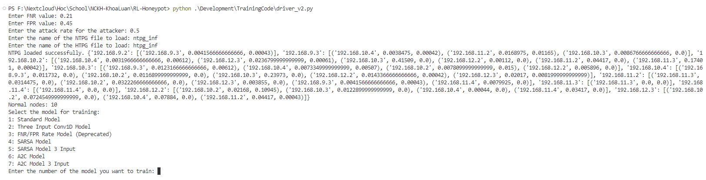
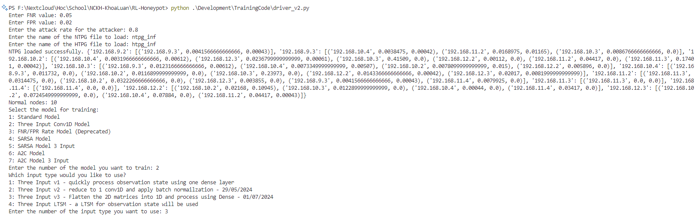
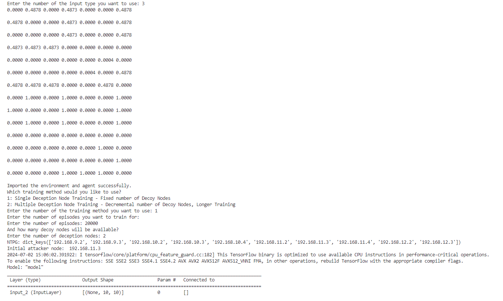
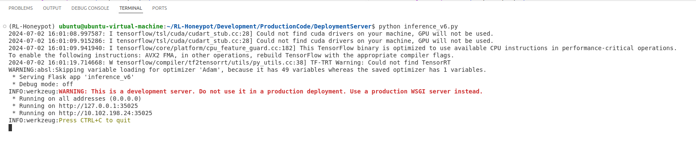
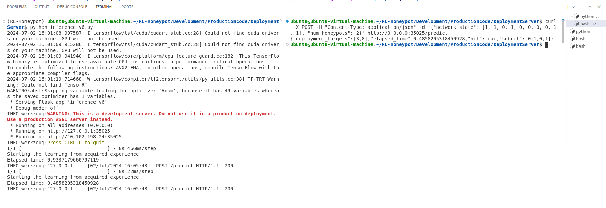

Em xin hướng dẫn thầy phương pháp chạy code huấn luyện và suy luận của model

# PHƯƠNG PHÁP HUẤN LUYỆN

Em thực hiện code này trên môi trường ảo với python 3.8.10, là mặc định của hệ điều hành Ubuntu 20.04 (Nếu ubuntu 22.04 sẽ lỗi và cần cài đặt python 3.8.10)

Phương pháp huấn luyện mô hình như sau

1. Kích hoạt môi trường ảo có sẵn

source bin/activate

2. Chạy code driver để tiến hành huấn luyện (mặc định đang ở thư mục gốc RL-Honeypot)

python Development/TrainingCode/driver_v2.py

driver_v2.py sẽ có các lựa chọn như sau:

Enter FNR value: Điền vào giá trị False Negative Rate mong muốn (mặc định 0.05, 0.1, 0.15, 0.2)

Enter FPR value: Điền vào giá trị False Positive Rate mong muốn (mặc định 0.02, 0.06, 0.1, 0.14)

Enter the attack rate for the attacker: Điền vào tỷ lệ sẽ thực hiện tấn công của attacker (mặc định 0.8)

Enter the name of the NTPG file to load: Điền vào tên file NTPG muốn load (string)

- Các file NTPG được tạo sinh ngẫu nhiên theo code sẽ được đánh số theo format: ntpg_xx (xx là số lượng node trong mạng)

- File NTPG được tạo dựa trên mạng thật có tên là: ntpg_inf

Enter the name of the HTPG file to load: Điền vào tên file HTPG muốn load (string)

- Các file HTPG được tạo sinh ngẫu nhiên theo code sẽ được đánh số theo format: htpg_xx (xx là số lượng node trong mạng)

- File HTPG được tạo dựa trên mạng thật có tên là: htpg_inf

Sau các lựa chọn này, driver code sẽ thực hiện xây dựng môi trường và show kết quả ra console như sau:

Tiếp đó, chúng ta lựa chọn model để huấn luyện, với các lựa chọn và tùy chỉnh gồm:

1: Standard Model (DDQN với 1 input là trạng thái quan sát được 1 chiều)
2: Three Input Conv1D Model (DDQN với 3 input là ma trận EPSS, ma trận NTPG và trạng thái quan sát được)
- 1: Three Input v1 - Xử lí trạng thái quan sát được bằng 1 lớp dense duy nhất (model gốc nguyên bản, hiện không sử dụng)
- 2: Three Input v2 - Giảm xuống còn 1 lớp Conv1D và sử dụng batch normalization - 29/05/2024 (Trong nghiên cứu của mình em đang dùng bản này)
- 3: Three Input v3 - Làm phẳng ma trận 2 chiều thành một chiều (Flatten) và xử lí bằng mạng Dense - 01/07/2024 (model mới nhất thầy vừa gửi)
- 4: Three Input LTSM - Sử dụng một hệ thống LTSM để xử lí trạng thái quan sát được (model cũ em thiết kế, hiện không sử dụng)
3: FNR/FPR Rate Model (Deprecated) (Mô hình cũ của FNR FPR, hiện nhóm đã tích hợp vào hết các model nên ko còn sử dụng)
4: SARSA Model (SARSA với 1 input là trạng thái quan sát được 1 chiều)
5: SARSA Model 3 Input (SARSA với 3 input là ma trận EPSS, ma trận NTPG và trạng thái quan sát được)
6: A2C Model (A2C với 1 input là trạng thái quan sát được 1 chiều)
7: A2C Model 3 Input (A2C với 3 input là ma trận EPSS, ma trận NTPG và trạng thái quan sát được)

Thông báo "Imported the environment and agent successfully." cho biết đã import agent và môi trường thành công.

Tiếp đó, chúng ta lựa chọn phương pháp huấn luyện:

1: Single Deception Node Training - Cho trực tiếp một số lượng honeypot xác định (1, 2, 3) và chỉ huấn luyện model với số lượng decoy này (Hầu hết trong nghiên cứu em để mặc định là 2)

2: Multiple Deception Node Training - Thực hiện huấn luyện model liên tiếp với số lượng honeypot từ (số lượng node trong mạng)/2 cho đến 1

Sau đó, chúng ta lựa chọn số lượng episode muốn huấn luyện (lưu ý, một episode có thể có nhiều step)

Thông thường để dừng tại các mốc step và đánh giá (từ 250 đến 30000) em sẽ set số episode sao cho khi x2 lên thì sẽ bằng/vượt số step mong muốn.

Chẳng hạn, 20000 episode có thể chạy đến 40000 step hoặc 80000 step tùy thuộc vào môi trường và model.

Enter the number of episodes: Điền vào số episode cần huấn luyện

Nếu như trước đó lựa chọn phương án huấn luyện "Single Deception Node Training", sau khi hỏi số episode, hệ thống sẽ hỏi tiếp như sau:

And how many decoy nodes will be available?

Enter the number of deception nodes: Điền vào số lượng honeypot cố định mà ta đã xác định trước ở trên (1, 2, 3, ...)

Nếu lựa chọn phương án huấn luyện "Multiple Deception Node Training", hệ thống sẽ chạy trực tiếp mà không qua câu hỏi, tuy nhiên cần lưu ý khi set episode 

vì nó sẽ lặp số episode đó cho từng số lượng honeypot khác nhau

Hình ảnh ví dụ sau khi chọn model DDQN 3 input bản thứ 2 và các phương án huấn luyện theo mặc định như sau:

Trong đó, Initial attacker node sẽ đại diện cho mục tiêu đầu tiên mà attacker sẽ di chuyển đến, do phần ntpg không chứa attacker. Để tạm khắc phục vị trí này, em cho attacker lựa chọn ngẫu nhiên 1 trong set 3 node hướng ra ngoài internet để tấn công và làm bàn đạp trước. Trọng số của việc ngẫu nhiên này chính là tỉ lệ EPSS tương tự như cách attacker di chuyển trong môi trường mạng.

Sau đó, hệ thống sẽ thực hiện huấn luyện và lưu kết quả đánh giá vào thư mục "output_dsp_trainingtime" và model vào thư mục "TrainedModel"

Format tên file của các file đánh giá sẽ như sau (ví dụ của DDQN):

"{model_name}result_fnr{fnr}_fpr{fpr}_model_{model_name}_{currentStep}_honeypotAmount_{deception_nodes}_{random_token}.txt"

Trong đó: 

- fnr/fpr là giá trị fnr fpr chúng ta set ở trên
- model_name là tên model chúng ta chọn
- currentStep là mốc step mà hệ thống thực hiện ngắt khỏi training để đánh giá (hiện là 9 mốc cố định từ 250 đến 30000)
- deception_nodes là số lượng honeypot có sẵn để triển khai
- random_token là một chuỗi ngẫu nhiên để phân biệt các file

VD: A2C_3_INPUTresult_fnr0.2_fpr0.14_model_A2C_3_INPUT_30000_honeypotAmount_2_cEd0x3ml.txt

Format tên file của các file model sẽ như sau (ví dụ của DDQN):

TrainedModel\\DDQN_3_INPUT\\RL_Honeypot_DDQN_3INPUT_win_ver3_{self.getStepCount()}_{random_token}.keras

Trong đó:

- DDQN_3_INPUT là tên model chúng ta chọn (tùy loại model sẽ có tên khác nhau và số input khác nhau, chẳng hạn A2C thì sẽ là A2C_3_INPUT)
- RL_Honeypot_{thuật toán được dùng}_3INPUT_win_ver3 là tên model sẽ được lưu lại theo thuật toán được dùng.
- self.getStepCount() là mốc step mà hệ thống thực hiện ngắt khỏi training để đánh giá (hiện là 9 mốc cố định từ 250 đến 30000)
- random_token là một chuỗi ngẫu nhiên để phân biệt các file

# PHƯƠNG PHÁP SUY LUẬN

Em xin hướng dẫn thầy phương pháp chạy code suy luận của model

Kích hoạt môi trường ảo có sẵn

source bin/activate

Di chuyển vào thư mục chứa code suy luận

cd \Development\ProductionCode\DeploymentServer

Chạy server suy luận 

python inference_v6.py (bản mới nhất mà nhóm đang sử dụng, với model DDQN 49890 step)

Sau khi chạy server, hệ thống sẽ hiện ra thông báo "Server is running on port 35025" như hình sau.

Để thực hiện suy luận, chúng ta cần mở một terminal khác và trực tiếp gửi request suy luận theo format sau:

curl -X POST -H "Content-Type: application/json" -d '{"network_state": [0, 1, 0, 0, 1, 0, 0, 1, 1, 1], "num_honeypots": 2}' http://0.0.0.0:35025/predict

Hoặc có thể feed request theo một đoạn code có sẵn (prefeed.py - di chuyển random trong môi trường)

python prefeed.py

Trong đó, network_state là trạng thái mạng hiện tại, num_honeypots là số lượng honeypot mà chúng ta muốn triển khai.

Kết quả trả về sẽ là một chuỗi JSON định dạng như sau:

{"deployment_targets":[3,8],"elapsed_time":0.4858205318450928,"hit":true,"subnet":[0,1,0,1]}

Trong đó:
- deployment_targets là danh sách các node mà model đề xuất triển khai honeypot
- elapsed_time là thời gian suy luận
- hit là kết quả của model, true nếu attacker đang tấn công vào mạng, false nếu không
- subnet là danh sách các subnet sẽ thực hiện triển khai honeypot vào

Đồng thời một file output.tmp chứa subnet cũng sẽ được lưu lại ở thư mục bên ngoài thư mục này, nhằm tương thích với hệ thống routing của Trường.